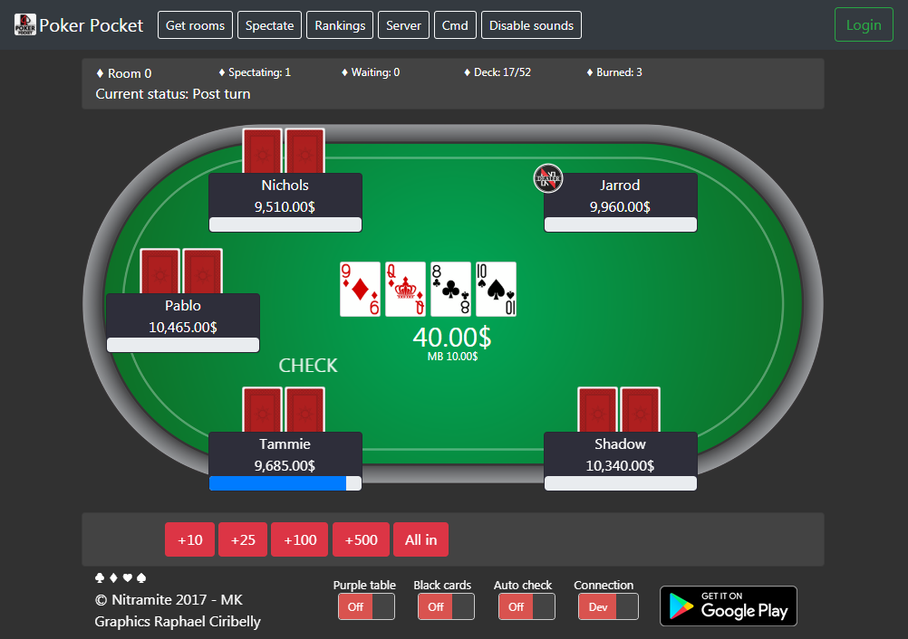

# Poker Pocket React Client

This project is a react version of [poker-pocket-web-client](https://github.com/norkator/poker-pocket-web-client) and it's web project which brings web ui for following game

backend:
[Poker-Pocket-Backend](https://github.com/norkator/Poker-Pocket-Backend)

Google Play Poker Pocket
application: [Google Play App](https://play.google.com/store/apps/details?id=com.nitramite.pokerpocket)

Table of contents
=================

* [Requirements](#requirements)* [Contributions](#contributions)
* [Contributors](#contributors)
* [License](#license)

Requirements
============

1. Get [Poker-Pocket-Backend](https://github.com/norkator/Poker-Pocket-Backend) and set it up running on local machine.
2. Edit `./src/clientConfig` to config backend's connection address.

Contributions
============

* Feel free to contribute code.

License
============
MIT
